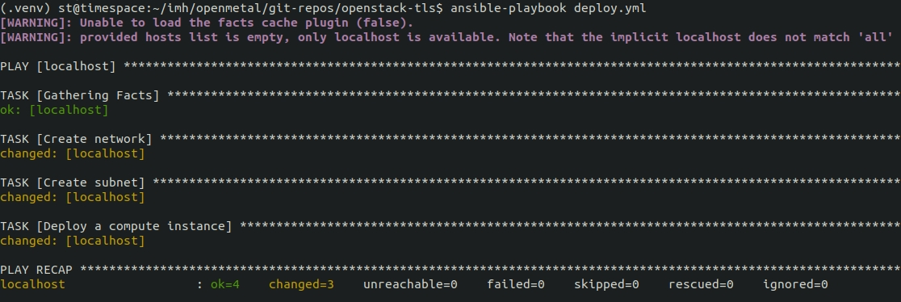

# Helper Ansible playbook to aid in Enabling TLS in OpenStack

WIP

The idea is to aid in enabling TLS in an OpenStack cloud using a certbot
instance. Once this finishes setting everything up, you only need to run Kolla
Ansible to finalize the SSL installation.

This playbook currently handles:

- Creates a private network and subnet
- Creates an instance on that private network and subnet

TODO:

- Install NGINX to the instance
- Configure NGINX with a specified domain

## Setup

1. Authentication (TODO: prefer token auth over using password)

   Obtain `clouds.yaml` from your cloud. Ensure it's located as
   `/etc/openstack/clouds.yaml`. Your OpenStack user's password must be
   hardcoded into this file.

2. The OpenStack cloud must have an SSH public key, which is added to the
   certbot instance. Define the variable for the public key in
   `./vars/globals.yml`.

3. Prepare environment 

   ```
   python3 -m venv .venv
   source .venv/bin/activate
   pip install -r requirements.txt
   ansible-galaxy collection install -r requirements.yml
   ```

## Configuration

Populate `./vars/globals.yml` with the needed configuration.

## Using

```
ansible-playbook deploy.yml
```


